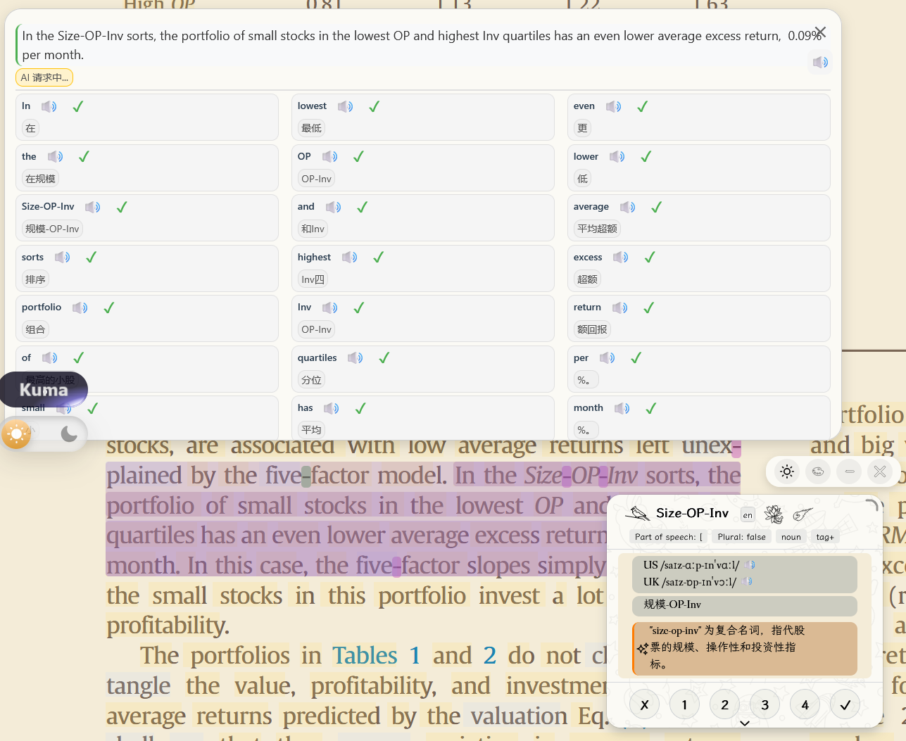
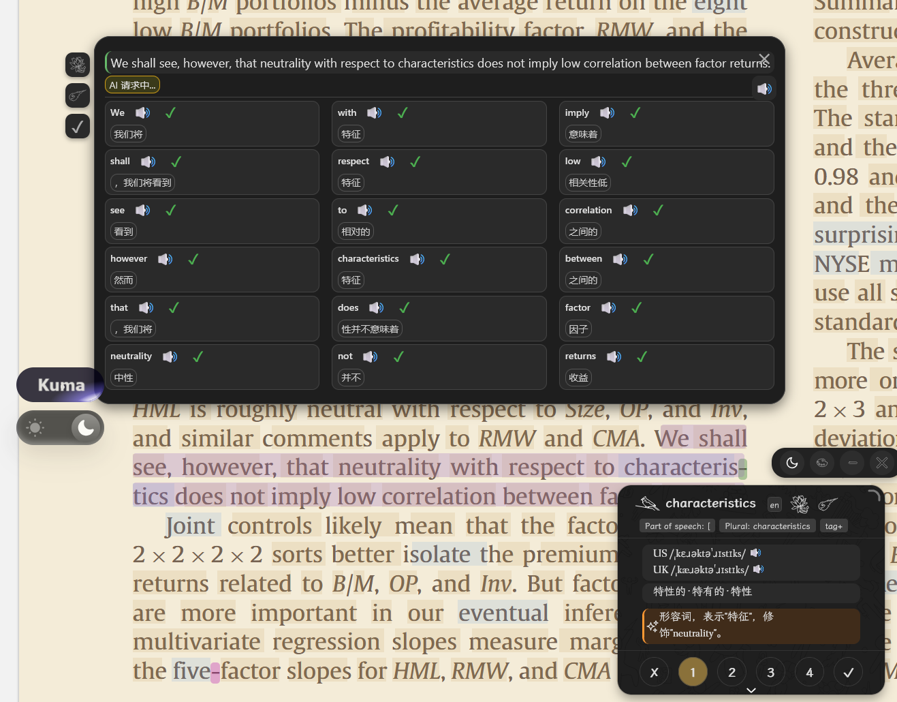

# LingKuma for Zotero

[English](README.md) | [简体中文](README_zh.md) | [日本語](README_ja.md) | [한국어](README_ko.md)

**See it. Click it. Learn it.**  
**わからないところは、クリック。**

[LingKuma 本家](https://github.com/lingkuma/LingKuma) · [LingKuma Wiki](https://docs.lingkuma.org) · [LingKuma 公式サイト](https://lingkuma.org/) · [Calibre 移植版](https://github.com/white-ink-cell/lingkuma-calibre)

LingKuma —— 言語の壁を越えて、知識を広げるために —— は、読書を中心に設計された翻訳・語学学習ツールです。

ある言語を「学び終える」まで、その言語の論文や本、文書を読むのを待つ必要はありません。

知らない単語に出会ったら、**クリック**。  
理解しにくい文に出会ったら、**クリック**。

LingKuma は、まだ学習途中の言語で書かれたコンテンツを読むことをサポートします。読書を楽しみながら自然に語彙を増やし、文法や表現に慣れ、その言語への理解を深めることができます。

> **まず読書を楽しみ、その過程で新しい言語を学ぶ。**

## LingKuma でできること

- 単語をクリックして意味を確認
- 文全体の翻訳と分析
- **Dictionary + Quick Context + AI Detail** による、より高速で正確な単語検索
- 辞書の実録音で単語の発音を再生し、米語 / 英語を個別に選択
- 読書中に語彙、意味、自分の学習記録を蓄積
- AI による文法、文脈、難しい文の解説
- Word Explosion で現在の文に含まれる複数の単語を確認
- カスタムボタンから外部辞書、検索エンジン、Wikipedia などの百科事典を開く
- Bionic Reading、Reading Ruler、POS Highlight
- オプションの WebDAV バックアップ / 復元
- ライト / ダークテーマ

より詳しい利用方法とプラットフォーム情報は [LingKuma Wiki](https://docs.lingkuma.org) を参照してください。

## スクリーンショット

ライトテーマ、英語 → 中国語翻訳：

ダークテーマ、英語 → 中国語翻訳：

ダークテーマ、英語 → ロシア語翻訳：

## Zotero 移植版

これはオープンソースプロジェクト LingKuma の非公式 Zotero 移植版です。

Zotero 移植版では、以下を追加・改善しています：

- 現行 Zotero 10 への対応と Zotero 9 互換性の維持
- PDF / EPUB 閲覧時の文選択改善
- より完全な文境界認識と改行修復
- 明示的な英語ハイフン複合語の認識
- Dictionary + Quick Context による高速な単語検索
- Zotero に対応したすりガラス効果
- Zotero 内蔵 PDF / EPUB リーダーとの統合
- Zotero 内の LingKuma 専用設定ページ

## v1.1.0 の主な更新

### Zotero 10 対応

旧版 LingKuma for Zotero は以前の Zotero プラグイン環境を前提としており、現在の Zotero では正常にインストールまたは動作しない場合があります。

本リリースでは **Zotero 10.0.x** に対応しつつ、**Zotero 9.x** との互換性も維持します。

同梱する LingKuma 上流も旧移植版の基準から **LingKuma 1.1.1** へ更新しました。

### より高速な検索：Dictionary + Quick Context + AI

以前は通常の単語意味も AI に大きく依存していたため、単純な検索でも生成待ちが発生し、形容詞と後続名詞が同じフレーズ全体として説明されるような曖昧な結果が出ることがありました。

現在は役割を三層に分けています：

1. **Dictionary** — 基本意味、品詞、語形、IPA、発音メタデータなどの安定した語彙情報。
2. **Quick Context** — **現在の文全体**を使った高速な非生成型の文脈翻訳。
3. **AI Detail** — 文法、複雑な用法、文解析、さらに詳しい説明。

通常の単語検索が AI の生成速度に強く依存しなくなり、AI はより深い理解に使われます。

### Word Explosion の高速化

Word Explosion の各単語の短い意味は、通常経路では単語ごとの AI 応答を待たず Quick Context を使用します。

文全体の翻訳やより深い AI 分析は引き続き利用できます。

### 文選択と文境界の改善

以前の Zotero 移植版で検証済みの修正を維持し、次を改善しています：

- PDF の位置指定テキストから文を再構築；
- 半文や誤った跨文選択を削減；
- 略語、頭文字、小数、引用符、括弧、コロン、セミコロンをより保守的に処理；
- PDF / EPUB のレイアウト改行による明白なハイフン分割を修復。

### ハイフン複合語

次のような語を複数の無関係な単語に分割せず、一つの検索・学習単位として扱えるようになりました：

- `well-known`
- `out-of-sample`
- `peer-on-peer`

一方、`inter-` + 改行 + `national` のようなレイアウト由来の分割は別ルールで扱い、明確な場合に `international` として保守的に修復します。

### 発音の改善：辞書音声 + IPA + 米語 / 英語

英語の発音は TTS のみに依存する方式から、**辞書の実録音を優先する方式**へ改善されました：

- 信頼できるデータがある場合、実際の表層形の IPA を表示；
- 米語 / 英語を個別に表示し、それぞれ独立して再生；
- 辞書の実録音があれば優先；
- 実際の語形に録音がない場合は TTS を使用。

上部の単語発音ボタンは：

- 米語のみ → 米語；
- 英語のみ → 英語；
- 両方あり → **米語を既定**；
- どちらもなし → TTS。

`books`、`worked`、`studies`、`working` などの活用形で特に有効です。

### 読書・学習機能を維持

Zotero で利用可能な LingKuma の読書ワークフローを引き続き維持しています：

- 語彙状態と保存した意味；
- 例文・学習記録；
- AI 文解析と詳細な単語説明；
- Bionic Reading；
- Reading Ruler；
- POS Highlight；
- カスタム外部検索 / 辞書 / 百科事典ボタン；
- ローカル語彙管理；
- WebDAV バックアップ / 復元；
- EPUB テキスト修復；
- Zotero 対応テーマとポップアップ動作。

## 現在の言語範囲

LingKuma 自体は多言語対応ですが、今回追加した**ローカル辞書による高速化は現在、主に英語ソーステキスト向け**です。

本リリースでは：

- 同梱ローカル辞書は **英語 → 簡体字中国語**；
- Quick Context は翻訳サービスが対応していれば設定した対象言語に従います；
- 他のソース言語向けローカル辞書パックはまだ同梱していません。

そのため、本リリースで最も大きな速度・語義安定性向上は**英語ソースの読書**で得られます。今後、より多くの言語組み合わせへ拡張する予定です。

## インストール

1. GitHub Releases から `lingkuma-zotero-1.1.0.xpi` をダウンロードします。
2. **Zotero → ツール → プラグイン** を開きます。
3. **ファイルからアドオンをインストール** を選択します（`.xpi` を直接ドラッグしても構いません）。
4. ダウンロードした `.xpi` を選択します。
5. 必要に応じて Zotero を再起動します。

> GitHub が自動生成するソースコード ZIP を Zotero プラグインとしてインストールしないでください。Release にある `.xpi` を使用してください。

## その他のバージョン

- [LingKuma for Calibre](https://github.com/white-ink-cell/lingkuma-calibre)
- [LingKuma](https://github.com/lingkuma/LingKuma)

## 対応環境

- Zotero 9.x
- Zotero 10.0.x
- PDF / EPUB リーダー統合
- 主なデスクトップ対象：Windows / macOS
- Linux：ベストエフォート互換（正式リリース試験対象外）

## 設定

設定画面は Zotero に統合されています。

**編集 → 設定 → LingKuma for Zotero** から開きます。

言語・翻訳、AI Provider / プロンプト、語彙管理、Dictionary、TTS、ポップアップと読書支援、オプションの WebDAV バックアップ / 復元などを設定できます。

## プライバシー

LingKuma for Zotero はローカル状態を Zotero のデータディレクトリに保存します。

## 上流プロジェクトとクレジット

- オリジナルプロジェクト：**[LingKuma](https://github.com/lingkuma/LingKuma)**
- LingKuma Wiki：**[docs.lingkuma.org](https://docs.lingkuma.org)**
- 上流バージョン：**LingKuma 1.1.1**
- Zotero 移植版のメンテナンスおよび公開：**white-ink-cell**

このリポジトリは LingKuma の非公式 Zotero 移植版です。

オリジナルプロジェクトの主要機能、インターフェース、アセット、デザインをできるだけ維持しながら Zotero の読書環境へ適応します。Zotero 固有の変更は、実行環境互換性、文選択、Dictionary / Quick Context、発音、複合語処理、すりガラス互換、多言語翻訳を中心としています。

詳細は `UPSTREAM.md` を参照してください。

## 辞書データ

同梱英語辞書は **English Wiktionary** の投稿者データを **Wiktextract** で抽出し、**Kaikki.org** が配布するデータを元に生成しています。

辞書テキストデータは **CC BY-SA 4.0** で配布されます。リモートの Wikimedia Commons 発音ファイルは、それぞれの配布元ページに記載された個別ライセンスに従います。

詳細は `licenses/ENGLISH-WIKTIONARY-DATA-NOTICE.txt` と `THIRD-PARTY-NOTICES.txt` を参照してください。

## ライセンス

オリジナル LingKuma の作者表記、著作権、ライセンスは変更されていません。

Zotero アダプターおよび互換レイヤーには `LICENSE-ADAPTER.txt` のライセンスが適用されます。オリジナル LingKuma ライセンスは `LICENSE-LINGKUMA.txt` に保持され、同梱するサードパーティのライセンスと通知は `THIRD-PARTY-NOTICES.txt` に記録されています。
