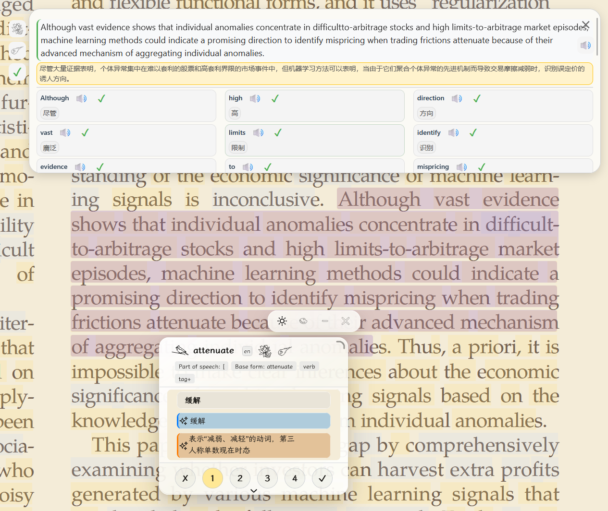
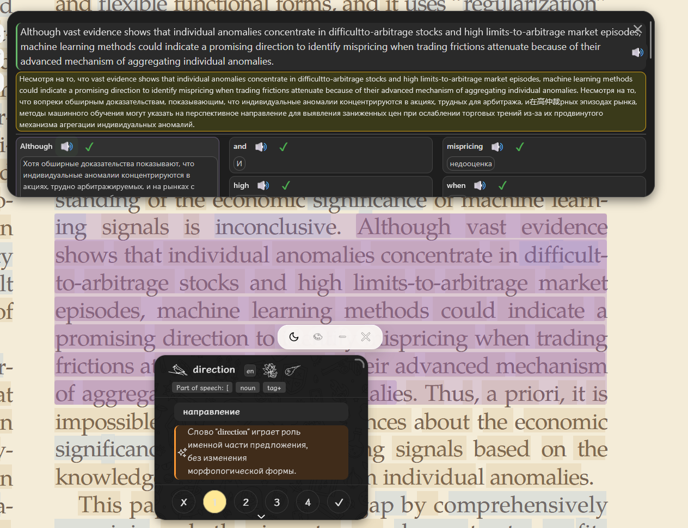

# LingKuma for Zotero

[English](README.md) | **简体中文** | [日本語](README_ja.md) | [한국어](README_ko.md)

这是基于 **LingKuma 1.1.0** 制作的非官方 Zotero 桌面移植版，让 LingKuma 的高亮、查词、翻译 / AI、整句分析、词库、TTS 和明暗主题功能可以在 Zotero 的 PDF / EPUB 阅读环境中使用。

> **Zotero 移植版发布 / 维护：[`white-ink-cell`](https://github.com/white-ink-cell)**  
> 本仓库不是 LingKuma 或 Zotero 的官方版本。LingKuma 原项目的作者、版权和许可证保持不变；`white-ink-cell` 仅表示本 Zotero 移植版的发布与维护者。

## 界面截图

浅色主题，英文 → 中文翻译：

深色主题，英文 → 俄文翻译：

## 主要改动

本移植版主要进行了四项适配。

### 1. Zotero 运行环境适配

在 LingKuma 外部增加 Zotero 兼容层，让原本依赖浏览器扩展环境的功能可以在 Zotero 阅读器中运行，同时尽量保持 LingKuma 原始功能和代码结构不变。

### 2. 句子选取优化

PDF.js 会把视觉上的一句话拆成多个定位文本片段，部分标点和排版也可能导致原版只选中半句话。移植版增加了句子边界判断和 PDF 文本重建规则，使整句翻译和 Word Explosion 更可靠地取得完整句子。

### 3. 磨砂玻璃效果适配

LingKuma 原版的液态玻璃效果依赖 Chromium 特有的渲染能力，而 Zotero 阅读器基于 Gecko，无法完整实现。移植版保留原来的 UI 和主题逻辑，并使用 Zotero 能稳定显示的磨砂玻璃效果作为兼容方案。

### 4. 多语言翻译适配

原版部分 AI Prompt 和语言处理逻辑默认以中文为目标语言。移植版补充了源语言识别和目标语言适配，使翻译、AI 解释、TTS 语言信息及相关语言显示能够按照用户选择的语言工作。

## 安装

1. 在 **GitHub Releases** 下载 `lingkuma-zotero-1.0.1.xpi`。
2. 打开 **Zotero → 工具 → 插件**。
3. 选择 **Install Add-on From File / 从文件安装插件**（也可以把 `.xpi` 拖入插件窗口）。
4. 选择下载的 `.xpi` 文件。
5. 重启 Zotero。

> 不要把 GitHub 自动生成的源码 ZIP 当作 Zotero 插件安装包，请使用 Releases 中的 `.xpi`。

## 支持环境

- Zotero 9.x
- PDF / EPUB 阅读器
- Windows / macOS / Linux

## 设置

设置界面直接集成在 Zotero 中，包括语言与 AI 设置、词库管理、TTS、界面显示以及可选的 WebDAV 备份 / 恢复。

## 数据与隐私

LingKuma for Zotero 的本地状态保存在 Zotero 数据目录中。使用翻译、AI、远程 TTS 或 WebDAV 时，完成所选功能所需的文本或数据可能会发送到相应服务。普通单词和句子翻译不会主动上传整份 PDF 或 EPUB 文件。

## 上游项目与署名

- 原项目：**LingKuma**
- 上游版本：**LingKuma 1.1.0**
- Zotero 移植版维护 / 发布：**white-ink-cell**

本项目的目标是把 LingKuma 移植到 Zotero。除 Zotero 运行所需的兼容处理外，原项目的主要功能、UI、资源和设计逻辑均尽量保持不变。

详细说明见 [`UPSTREAM_zh.md`](UPSTREAM_zh.md)。

## 许可证

LingKuma 原项目的作者、版权和许可证保持不变。Zotero 适配 / 兼容层见 [`LICENSE-ADAPTER.txt`](LICENSE-ADAPTER.txt)，LingKuma 上游许可证见 [`LICENSE-LINGKUMA.txt`](LICENSE-LINGKUMA.txt)，第三方资源声明见 [`THIRD-PARTY-NOTICES.txt`](THIRD-PARTY-NOTICES.txt)。

## 其他移植版

- [LingKuma for Calibre](https://github.com/white-ink-cell/lingkuma-calibre)
