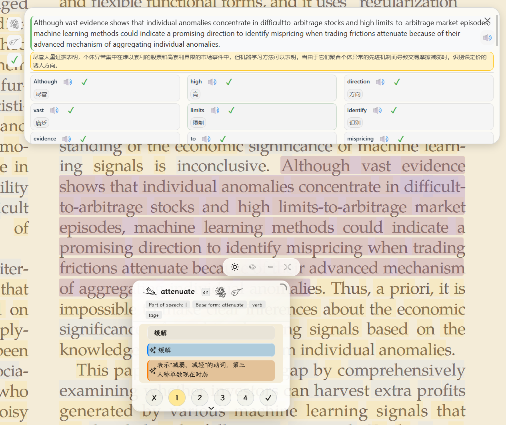
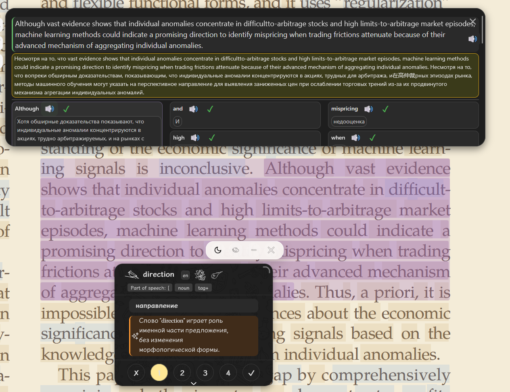

# LingKuma for Zotero

[English](README.md) | [简体中文](README_zh.md) | [日本語](README_ja.md) | [한국어](README_ko.md)

**See it. Click it. Learn it.**  
**哪里不会点哪里**

[LingKuma 原项目](https://github.com/lingkuma/LingKuma) · [LingKuma Wiki](https://docs.lingkuma.org) · [LingKuma 官网](https://lingkuma.org/) · [Calibre 移植版](https://github.com/white-ink-cell/lingkuma-calibre)

LingKuma —— *让知识跨越语言的障碍* —— 是一款围绕阅读设计的翻译与语言学习工具。

你不需要等到“学会”一门语言之后，才能开始阅读这门语言的论文、书籍和文档。

遇到不认识的单词，**点一下**。  
遇到看不懂的句子，**点一下**。

LingKuma 帮助你阅读仍在学习中的语言内容，让你在阅读过程中自然地扩大词汇量、熟悉语法和表达方式，并逐渐提高对这门语言的理解能力。

> **先享受阅读，再在阅读中学会一门新的语言。**

## LingKuma 可以做什么？

- 点击单词查看释义
- 翻译并分析完整句子
- 使用 **Dictionary + Quick Context + AI Detail** 更快、更稳定地查词
- 使用字典真人发音与 TTS 兜底收听单词发音
- 在数据可用时查看 IPA，并分别选择美音或英音
- 在阅读过程中积累词汇、释义和个人学习记录
- 使用 AI 辅助理解语法、上下文与复杂句子
- 使用“单词爆炸”快速查看当前句中的多个单词
- 通过自定义按钮一键打开外部词典、搜索引擎或 Wikipedia 等百科网站
- 使用 Bionic Reading、Reading Ruler 和 POS Highlight
- 使用可选 WebDAV 备份 / 恢复学习数据
- 支持亮色和暗色主题
- 在 Zotero 中尽量保留 LingKuma 原有风格的界面

更多 LingKuma 使用说明和平台文档，请查看 [LingKuma Wiki](https://docs.lingkuma.org)。

## 截图

亮色主题，英文 → 中文翻译：

暗色主题，英文 → 俄文翻译：

## Zotero 移植版

这是开源项目 LingKuma 的非官方 Zotero 移植版。

Zotero 移植版增加了：

- Zotero 运行环境适配
- 适配当前 Zotero 10，同时继续兼容 Zotero 9
- 改进 PDF / EPUB 阅读中的句子选取
- 更完整的断句与更保守的断行修复
- 显式英文连字符复合词识别
- Dictionary + Quick Context 加速查词
- 适用于 Zotero 的磨砂玻璃效果
- 多语言翻译与 AI 输出支持
- 与 Zotero 内置 PDF / EPUB 阅读环境集成
- 集成在 Zotero 内的 LingKuma 原生设置页面

## v1.1.0 本次更新

这次不是一次简单的小修，而是 Zotero 移植版的一次较大更新。

### 更新 Zotero 10 兼容性

旧版 LingKuma for Zotero 基于更早的 Zotero 插件环境，在当前 Zotero 中可能已经无法正常安装或工作。

本次更新重新适配 **Zotero 10.0.x**，同时继续兼容 **Zotero 9.x**。

移植所使用的 LingKuma 上游也从旧版基线更新到 **LingKuma 1.1.1**。

### 更快的查词：Dictionary + Quick Context + AI

过去普通词义较大程度依赖 AI，因此简单查词也可能受到生成速度影响；AI 有时还会把“当前单词”和它所在的短语一起解释，例如形容词和后面的名词都显示成同一整段短语，让人难以判断哪个释义对应哪个词。

现在把查词职责拆成三层：

1. **Dictionary（字典）**：快速提供基础词义、词性、词形、IPA 和发音等较稳定的词典信息。
2. **Quick Context（快速语境）**：使用**完整当前句子**进行快速、非生成式的语境翻译，再取出当前查词单位在该句中的意思。
3. **AI Detail（AI 深度解释）**：继续负责语法、复杂用法、句子分析和更深入的解释。

因此，普通查词不再大幅依赖 AI 的生成速度，同时又保留 AI 在复杂理解上的优势。

当前 XPI 内置的英语词典包含 **83,535 个词条**，数据来自 English Wiktionary，经 Kaikki / Wiktextract 提取整理。

### “单词爆炸”更快

“单词爆炸”中每个可见单词的小释义，在正常路径下不再分别等待一次 AI 请求，而是优先使用 Quick Context。

整句翻译和更深入的 AI 分析仍然保留。

### 延续并增强断句与句子选择

本次继续保留旧版 Zotero 移植中已经验证过的句子兼容修复，并进一步保持：

- 改进 PDF 定位文本的句子重建；
- 减少只取半句或误跨句的问题；
- 更保守地处理缩写、首字母、数字小数、引号、括号、冒号和分号；
- 修复明显由 PDF / EPUB 排版断行造成的连字符断词。

### 支持带横杠的复合词

过去下面这类词可能会被错误拆开：

- `well-known`
- `out-of-sample`
- `peer-on-peer`

现在会尽可能把这种显式英文连字符复合词视为一个完整的查词和学习单位。

而 `inter-` + 换行 + `national` 这种由排版断行造成的情况仍然单独处理，并在明确时保守修复为 `international`。

### 发音升级：字典真人发音 + IPA + 美音 / 英音

英语查词的发音从单纯依赖 TTS，升级为**字典真人发音优先**：

- 有可靠数据时显示当前实际词形的 IPA；
- 美音和英音可以分别显示；
- 美音与英音按钮可以独立播放；
- 有字典真人录音时优先使用真人录音；
- 当前实际词形没有录音时，再使用 TTS，而不是错误地拿词根或原形的发音代替。

最上方单词的默认发音规则为：

- 只有美音录音 → 播放美音；
- 只有英音录音 → 播放英音；
- 美音和英音都有 → **默认美音**；
- 两种录音都没有 → 使用 TTS 兜底。

这对 `books`、`worked`、`studies`、`working` 等 `-s / -ed / -ing` 实际词形尤其重要。

> Quick Context 负责的是**语境翻译**，不是发音。发音链由字典真人录音和 TTS 兜底组成。

### 阅读与学习功能继续保留

本次升级继续保留或恢复适用于 Zotero 的 LingKuma 阅读工作流，包括：

- 生词 / 熟词状态与保存的词义；
- 例句与学习记录；
- AI 句子分析和更深入的单词解释；
- Bionic Reading；
- Reading Ruler；
- POS Highlight；
- 自定义外部搜索 / 词典 / 百科按钮；
- 本地词库管理；
- WebDAV 备份 / 恢复；
- EPUB 文本修复选项；
- Zotero 兼容的主题和弹窗行为。

## 当前语言范围

LingKuma 原项目仍然是多语言工具，但这次新增的**本地字典加速目前主要针对英语源文本**。

本版本中：

- 内置本地词典是 **英语 → 简体中文**；
- Quick Context 在服务支持的情况下可以按照用户设置的目标语言工作；
- 其他源语言对应的本地字典包目前还没有一起加入。

因此，这一版最明显的速度与词义稳定性提升集中在**英语源文本阅读**。后续版本计划继续扩展更多语言组合的字典加速。

## 安装

1. 从 **GitHub Releases** 下载 `lingkuma-zotero-1.1.0.xpi`。
2. 打开 **Zotero → 工具 → 插件**。
3. 使用 **从文件安装插件**（也可以直接将 `.xpi` 拖入插件窗口）。
4. 选择下载的 `.xpi` 文件。
5. 如 Zotero 提示则重启。

> 不要将 GitHub 自动生成的源码 ZIP 作为 Zotero 插件安装。请使用 Release 中提供的 `.xpi` 文件。

## 其他版本

- [LingKuma for Calibre](https://github.com/white-ink-cell/lingkuma-calibre)
- [LingKuma](https://github.com/lingkuma/LingKuma)

## 支持环境

- Zotero 9.x
- Zotero 10.0.x
- PDF 和 EPUB 阅读器集成
- Windows 与 macOS 为主要桌面支持目标
- Linux 为尽力兼容，不作为正式发布测试目标

## 设置

设置界面已经集成到 Zotero 中。

打开 **Zotero → 设置 → LingKuma for Zotero**。

当前包括语言和翻译设置、AI Provider / 提示词、词汇管理、Dictionary、TTS、弹窗与阅读辅助，以及可选的 WebDAV 备份 / 恢复。

## 隐私

LingKuma for Zotero 将本地状态存储在 Zotero 数据目录中。

根据实际使用的功能：

- 本地 Dictionary 查词保留在本机；
- Quick Context 会把当前句子 / 标记后的查词单位发送到配置的快速翻译路径；
- AI 功能会把需要解释的文本发送给用户所选择的 AI 服务；
- 发音可能读取远程字典音频，或使用远程 / 本地 TTS；
- WebDAV 只会在用户配置并使用备份 / 恢复时访问。

普通单词或句子查词不会主动上传整份 PDF 或 EPUB 文件。

## 上游项目与署名

- 原项目：**[LingKuma](https://github.com/lingkuma/LingKuma)**
- LingKuma Wiki：**[docs.lingkuma.org](https://docs.lingkuma.org)**
- 上游版本：**LingKuma 1.1.1**
- Zotero 移植版维护与发布：**white-ink-cell**

本仓库提供 LingKuma 的非官方 Zotero 移植版。

该移植版使 LingKuma 能够适配 Zotero 的阅读环境，同时尽可能保留原项目的核心功能、界面、资源和整体设计。Zotero 专用修改主要集中在运行环境兼容、句子选取、Dictionary / Quick Context、发音、复合词处理、磨砂玻璃效果和多语言翻译支持。

更多信息请参阅 `UPSTREAM.md`。

## 字典数据

内置英语词典基于 **English Wiktionary** 贡献者数据，经 **Wiktextract** 提取并由 **Kaikki.org** 分发的数据生成。

词典文本数据按照 **CC BY-SA 4.0** 分发。远程 Wikimedia Commons 发音文件继续遵循其来源页面所标注的独立许可证。

详见 `licenses/ENGLISH-WIKTIONARY-DATA-NOTICE.txt` 和 `THIRD-PARTY-NOTICES.txt`。

## 许可证

原 LingKuma 项目的作者署名、版权和许可证保持不变。

Zotero 适配器和兼容层使用 `LICENSE-ADAPTER.txt` 中的许可证。原 LingKuma 的许可证保留在 `LICENSE-LINGKUMA.txt` 中，随项目一起提供的第三方许可证和声明记录在 `THIRD-PARTY-NOTICES.txt` 中。

